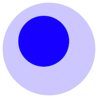

# Foam

**👋 Welcome to the CryptHub Knowledge Base!**

## Getting started
### Dive in to our [Foam](https://github.com/foambubble) based Knowledge base!

- [Wiki Index](https://github.com/IncognitLabs/CryptHub-Docs/blob/f06486b12170e405b682c56fc9213b6ef42476fd/docs/index.md)
- [inbox](./inbox.md) - a place to write down quick notes to be categorized later
- [getting-started](./getting-started.md) - learn how to use your Foam workspace
- [todo](./todo.md) - a place to keep track of things to do

In the `docs` directory you can find everything you need to learn the basics of Foam.

## Submitting Issues

As you may have noticed, issues are disabled. With the goal to keep the project fairly easy to maintain, please file your issues in the main Foam repository:

> <https://github.com/foambubble/foam>
